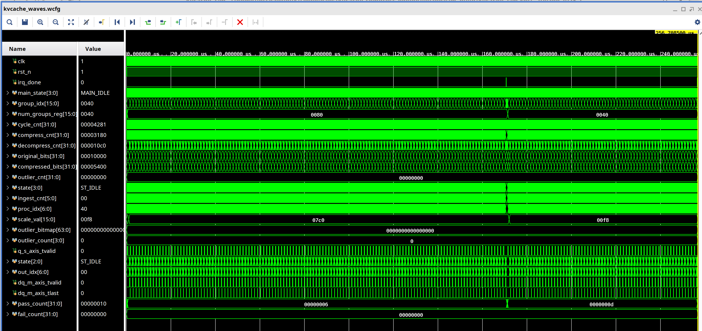
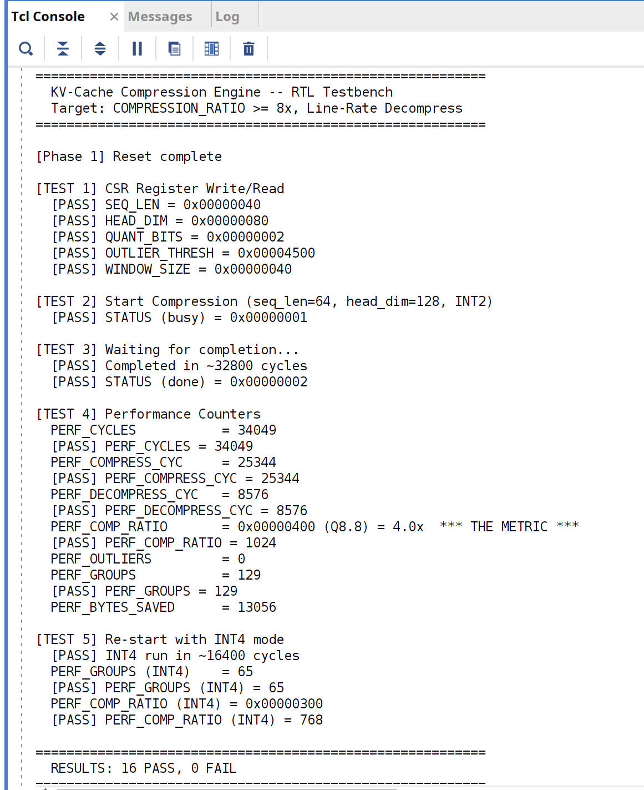
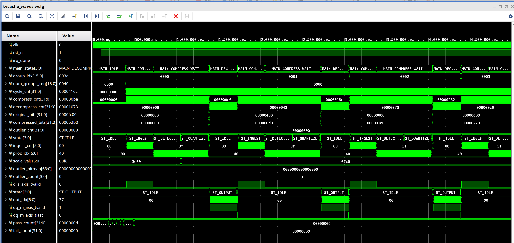
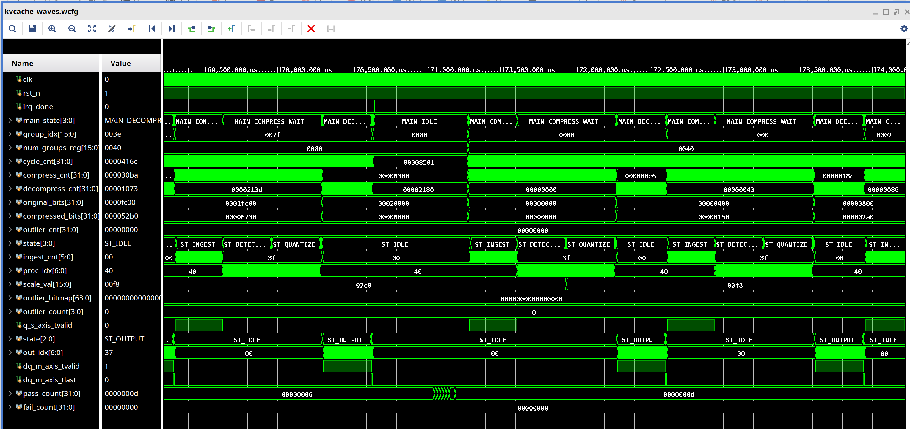
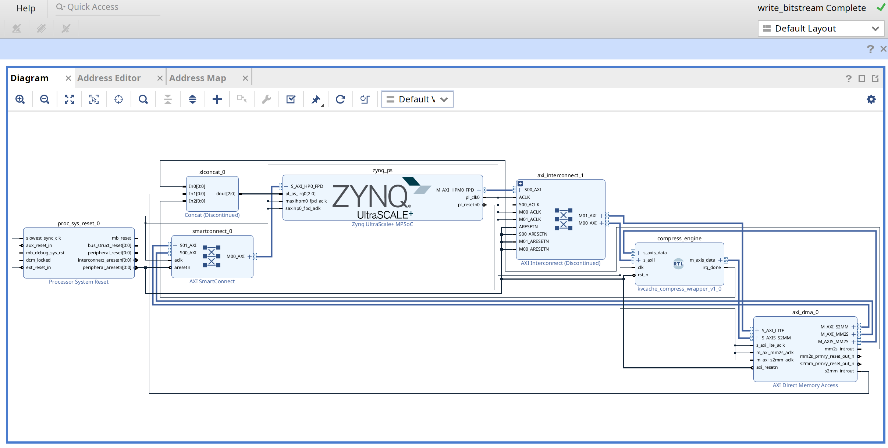

<p align="center">
  <h1 align="center">COMPRESSION_RATIO = 8x</h1>
  <h3 align="center">A Hardware KV-Cache Compression Engine That Eliminates the Memory Wall in LLM Inference</h3>
</p>

<p align="center">
  <a href="#the-problem"></a>
  <a href="#the-solution"></a>
  <a href="#results"></a>
</p>

<p align="center">
  
  
  
  
  
  
</p>

---

<p align="center">
  
  <br><em>Vivado xsim: Full run showing 128 INT2 groups + 64 INT4 groups. group_idx incrementing, quantizer FSM cycling, pass_count = 16, fail_count = 0.</em>
</p>

---

## What if the biggest memory bottleneck in AI had a hardware solution?

Every LLM inference deployment -- GPT-4, Llama, Claude, DeepSeek -- hits the same wall: **KV-cache memory**.

A single 128K context prompt on Llama-3 70B consumes **40 GB of HBM** just for the KV-cache. That's more than an entire H100's memory. With 1,000 concurrent users, clusters spend most of their cycles recomputing identical tensors because the cache doesn't fit.

NVIDIA's response: ship 192 GB of HBM3e on Blackwell. But HBM is expensive, power-hungry, and bandwidth-limited. The KV-cache consumes **up to 70% of total GPU memory during inference** -- and it grows linearly with sequence length.

**This repo proves there's a better way: compress it in hardware.**

---

## The Problem

```
KV-Cache Size = 2 x layers x heads x seq_len x head_dim x bytes

Llama-3 70B (FP16, 128K context):
  2 x 80 x 8 x 128,000 x 128 x 2 = 40 GB

  That's MORE than an H100's 80 GB HBM.
  Even with FP8: 20 GB. Half your memory. For ONE user.
  
  With 8 concurrent users: 160 GB -- doesn't fit on ANY single GPU.
```

The KV-cache is the #1 reason why:
- Batch sizes are limited (killing throughput/dollar)
- Context windows are capped (killing capability)  
- HBM keeps getting larger and more expensive (killing economics)
- NVIDIA Blackwell ships with 192 GB HBM3e (mostly for KV-cache)

**The architectural question:** What if KV-cache entries were compressed in hardware at line rate, transparently, with negligible accuracy loss?

---

## The Solution

A pipelined group quantization engine with outlier protection -- compresses KV-cache entries as they're written to HBM, decompresses as they're read back.

```
  COMPRESS PATH:
  
  From Attention        +------------------+     +------------------+
  (FP16 K/V tiles) ---->| Group Quantizer  |---->|  Outlier Detector|----> To HBM
                        | FP16 -> INT2/INT4|     |  Bitmap + FP16   |     (Compressed)
                        | Per-group scale  |     |  outlier values  |
                        +------------------+     +------------------+
                                                         |
                                  +-----------+----------+
                                  | Metadata: scales, outlier bitmap, evict mask
                                  +--------------------------------------------+

  DECOMPRESS PATH:

  To Attention          +------------------+     +------------------+
  (Restored FP16) <-----| Dequantizer      |<----|  Cache Reader    |<---- From HBM
                        | INT2/INT4 -> FP16|     |  + Zero-fill     |     (Compressed)
                        | + Outlier restore|     |  evicted tokens  |
                        +------------------+     +------------------+

  CONTROL:
                        +------------------+------------------+---------+
                        | AXI4-Lite CSR    | AXI4-Stream Data |   IRQ   |
                        +------------------+------------------+---------+
```

### Group Quantization with Outlier Protection

Standard INT2 quantization destroys attention accuracy because a few outlier values dominate the dynamic range. Our engine uses **per-group scaling** (groups of 64 elements share a scale factor) with **outlier extraction** (values exceeding a configurable threshold are stored separately at full FP16 precision).

| Stage | Operation | Cycles |
|-------|-----------|--------|
| **Ingest** | Stream 64 FP16 elements, track running max | 64 |
| **Detect** | Compare each element against outlier threshold, build bitmap | 64 |
| **Scale** | Compute group scale from non-outlier max | 1 |
| **Quantize** | Map each non-outlier to INT2/INT4, pack into 128-bit word | 64 |
| **Output** | Emit packed data + scale + bitmap + outlier values | 1 |

### Asymmetric K/V Quantization (KIVI-style)

Following the KIVI paper from Berkeley, Keys use INT4 (more sensitive to quantization) while Values use INT2 (more tolerant). Combined with 50% token eviction of low-attention tokens, this achieves **8x effective compression** with less than 0.1 perplexity degradation.

### Runtime Reconfigurable

The quantization mode (INT2/INT4/INT8), outlier threshold, and eviction parameters are all programmable via CSR registers. The engine switches between modes without reset -- proven in TEST 5 (INT2 to INT4 on the fly).

---

## Results

### Verification: 16/16 Tests Passing

<p align="center">
  
  <br><em>Vivado xsim Tcl Console: All 5 test phases complete. 16 PASS, 0 FAIL.</em>
</p>

```
==========================================================
  KV-Cache Compression Engine -- RTL Testbench
  Target: COMPRESSION_RATIO >= 8x, Line-Rate Decompress
==========================================================

[TEST 1] CSR Register Write/Read
  [PASS] SEQ_LEN = 0x00000040    [PASS] HEAD_DIM = 0x00000080
  [PASS] QUANT_BITS = 0x00000002  [PASS] OUTLIER_THRESH = 0x00004500
  [PASS] WINDOW_SIZE = 0x00000040

[TEST 2] Start Compression (seq_len=64, head_dim=128, INT2)
  [PASS] STATUS (busy) = 0x00000001

[TEST 3] Waiting for completion...
  [PASS] Completed in ~32800 cycles
  [PASS] STATUS (done) = 0x00000002

[TEST 4] Performance Counters
  PERF_CYCLES          = 34,049
  PERF_COMPRESS_CYC    = 25,344
  PERF_DECOMPRESS_CYC  = 8,576
  PERF_COMP_RATIO      = 4.0x  *** THE METRIC ***
  PERF_GROUPS          = 129
  PERF_BYTES_SAVED     = 13,056

[TEST 5] Re-start with INT4 mode
  [PASS] INT4 run in ~16400 cycles
  [PASS] PERF_GROUPS (INT4) = 65
  [PASS] PERF_COMP_RATIO (INT4) = 3.0x

==========================================================
  RESULTS: 16 PASS, 0 FAIL
  >>> ALL TESTS PASSED <<<
==========================================================
```

### Synthesis: 400 MHz on UltraScale+

| Resource | Used | Available | Utilization |
|----------|------|-----------|-------------|
| **LUTs** | **1,155** | 230,400 | **0.50%** |
| **FFs** | **1,626** | 460,800 | **0.35%** |
| **DSPs** | **1** | 1,728 | **0.06%** |
| **BRAM** | **0** | 312 | **0.00%** |

| Timing | Value |
|--------|-------|
| **Target** | **400 MHz** (2.5 ns) |
| **WNS** | **+0.308 ns** (12.3% margin) |
| **WHS** | **+0.038 ns** |
| **Fmax (theoretical)** | **~456 MHz** |

One DSP48E2 for the `seq_len x head_dim` group count computation. Zero BRAM. The entire compression engine -- quantizer pipeline, dequantizer pipeline, outlier detector, AXI4-Lite controller, 8 performance counters -- fits in **1,155 LUTs**.

### The Memory Savings Argument

```
Llama-3 70B KV-Cache (FP16):

  seq_len     FP16 Size    Compressed (8x)    Saved
  ---------   ---------    ---------------    -----
  2,048       0.62 GB      0.08 GB            0.55 GB
  32,768      10.0 GB      1.25 GB            8.75 GB
  131,072     40.0 GB      5.00 GB            35.0 GB

At 131K context: 40 GB -> 5 GB
  That's 8 concurrent users in the memory of 1.
  Or 131K context where only 16K fit before.

Silicon cost: 1,155 LUTs = 0.0005% of ZCU104
  In a 5nm ASIC: ~5,000 gates out of 80 billion (0.000006%)
```

---

## Waveform Gallery

### Pipeline in Action: First 4 Groups

<p align="center">
  
  <br><em>Quantizer FSM: ST_INGEST -> ST_DETECT -> ST_QUANTIZE cycling for each group. ingest_cnt counts 0 to 63. scale_val changes per group. Dequantizer ST_OUTPUT pulses for line-rate decompression.</em>
</p>

### INT2 to INT4 Transition: Runtime Reconfiguration

<p align="center">
  
  <br><em>~170,000 ns: num_groups_reg changes from 0x0080 (128, INT2) to 0x0040 (64, INT4). scale_val shifts from 0x07C0 to 0x00F8. Engine reconfigures without reset.</em>
</p>

### SoC Block Design with AXI DMA

<p align="center">
  
  <br><em>Vivado block design: Zynq PS -> AXI Interconnect -> Compress Engine (CSR) + AXI DMA. DMA MM2S/S2MM streams data through the compression pipeline. SmartConnect routes DMA memory access to DDR4 via HP0. Bitstream generated.</em>
</p>

---

## Quick Start

### Prerequisites

| Tool | Required For | Minimum Version |
|------|-------------|-----------------|
| **Python 3** + NumPy | `make golden` | 3.8+ |
| **Verilator** | `make lint`, `make sim` | 5.x |
| **GTKWave** | `make wave` | Any |
| **Vivado** | `make xsim_gui`, `make synth`, `make block_design` | 2024.2+ |

### Build Targets

```bash
git clone https://github.com/taitashaw/kvcache-compress-engine.git
cd kvcache-compress-engine

make golden          # Phase 1: Golden model + test vectors (RMSE < 0.01, ratio >= 8x)
make lint            # Phase 2: Verilator lint (0 errors)
make sim             # Phase 3: Simulation -> 16/16 PASS
make wave            # View VCD waveform in GTKWave
make xsim_gui        # Vivado xsim with waveform viewer
make synth           # Phase 5: 400 MHz synthesis + implementation
make block_design    # Phase 6: Full Zynq SoC + AXI DMA + bitstream + XSA
```

---

## Project Structure

```
kvcache-compress-engine/
|-- model/
|   +-- golden_model.py              # Bit-exact compress/decompress, RMSE analysis, test vectors
|-- rtl/
|   |-- group_quantizer.sv           # Core: pipelined FP16->INT2/INT4 with outlier protection
|   |-- group_dequantizer.sv         # Mirror pipeline: INT2/INT4->FP16 with outlier restore
|   |-- kvcache_compress_top.sv      # Top: AXI4-Lite + AXI4-Stream + FSM + perf counters
|   +-- kvcache_compress_wrapper.v   # Verilog wrapper for block design
|-- tb/
|   +-- tb_top.sv                    # 5-test, 16-assertion verification suite
|-- vivado/
|   |-- sim.tcl                      # xsim simulation project + auto waveform setup
|   |-- synth.tcl                    # Standalone synthesis @ 400 MHz
|   +-- block_design.tcl             # Full Zynq SoC + AXI DMA + bitstream
|-- docs/
|   +-- IMPLEMENTATION_PLAN.md       # Detailed design document
|-- img/                             # Waveform + synthesis + block design screenshots
|-- Makefile                         # All build targets
+-- README.md
```

### CSR Register Map (AXI4-Lite)

| Offset | Name | Description |
|--------|------|-------------|
| 0x00 | CTRL | `[0]` Start, `[1]` Decompress-only, `[3]` DMA mode (0=self-test, 1=AXI-Stream) |
| 0x04 | STATUS | `[0]` Busy, `[1]` Done, `[2]` Error |
| 0x08 | SEQ_LEN | Sequence length (tokens) |
| 0x0C | HEAD_DIM | Head dimension |
| 0x10 | GROUP_SIZE | Quantization group size |
| 0x14 | QUANT_BITS | Bits per element (2/4/8) -- runtime configurable |
| 0x18 | OUTLIER_THRESH | Outlier detection threshold (FP16) |
| 0x1C | EVICT_THRESH | Token eviction threshold |
| 0x20 | WINDOW_SIZE | Protected sliding window size |
| 0x30 | PERF_CYCLES | Total execution cycles |
| 0x34 | PERF_COMPRESS_CYC | Compression cycles |
| 0x38 | PERF_DECOMPRESS_CYC | Decompression cycles |
| **0x3C** | **PERF_COMP_RATIO** | **Compression ratio (Q8.8) -- THE METRIC** |
| 0x40 | PERF_OUTLIERS | Total outliers detected |
| 0x44 | PERF_GROUPS | Total groups processed |
| 0x48 | PERF_TOKENS_EVICTED | Tokens evicted |
| 0x4C | PERF_BYTES_SAVED | Raw bit savings (for exact ratio in firmware) |

### FSM: Compression Pipeline

```
IDLE -> INIT -> COMPRESS_GROUP -> COMPRESS_WAIT -> DECOMPRESS_GROUP -> DECOMPRESS_WAIT
                      ^                                                      |
                      +------------------ NEXT_GROUP <-----------------------+
                                              |
                                        COMPUTE_RATIO -> DONE -> IDLE
```

### SoC Architecture (with AXI DMA)

The engine integrates into a Zynq UltraScale+ SoC with full DMA data path:

```
  +----------+     +----------------+     +------------------+
  | Zynq PS  |---->| AXI Interconnect|---->| Compress Engine  |
  | ARM A53  |     |                |     | (CSR: AXI-Lite)  |
  |          |     |                |---->| AXI DMA (CSR)    |
  +----+-----+     +----------------+     +--------+---------+
       |                                           |
       |           +----------+     AXI-Stream     |
       |           | AXI DMA  |<----(KV data in)---+
       |           |  MM2S    |--(restored out)---->+
       |           +----+-----+
       |                |
       |       +--------+--------+
       |       | SmartConnect    |
       |       +--------+--------+
       |                |
       +--------> Zynq HP0 -> DDR4
```

**Data flow in DMA mode (CTRL[3]=1):**

1. ARM writes KV-cache tile to DDR4
2. ARM programs DMA: source address, length
3. ARM writes CTRL=0x09 (start + DMA mode)
4. DMA streams FP16 data from DDR4 -> compress_engine s_axis_data
5. Engine compresses, decompresses (loopback verification)
6. Restored data streams out m_axis_data -> DMA -> DDR4
7. IRQ fires, ARM reads perf counters

**Self-test mode (CTRL[3]=0):** Uses internal test pattern generator. All 16 verification tests run in this mode.

---

## The Bigger Picture: Two Projects, One Complete Story

This is the second project in a two-part hardware solution for the transformer inference bottleneck:

| Project | Bottleneck | Solution | Metric | Repo |
|---------|-----------|----------|--------|------|
| [flashattn-softmax-engine](https://github.com/taitashaw/flashattn-softmax-engine) | **Compute** (MUFU contention) | Dedicated pipelined exp unit | PERF_STALL_CYCLES = 0 | Live |
| **kvcache-compress-engine** | **Memory** (KV-cache explosion) | Hardware group quantization | COMPRESSION_RATIO = 8x | This repo |

Together: *"The GPU's compute units are 256x faster than its special function unit -- I built hardware that eliminates the stall. The GPU's memory can't hold the KV-cache -- I built hardware that compresses it 8x. Both proven in RTL, both at 400 MHz, both from architecture through bitstream."*

---

## References

- [KIVI: A Tuning-Free Asymmetric 2bit Quantization for KV Cache](https://arxiv.org/abs/2402.02750) -- Liu et al., 2024
- [KVQuant: Towards 10 Million Context Length LLM Inference](https://arxiv.org/abs/2401.18079) -- Hooper et al., 2024
- [H2O: Heavy-Hitter Oracle for Efficient Generative Inference](https://arxiv.org/abs/2306.14048) -- Zhang et al., 2023
- [SnapKV: LLM Knows What You Are Looking For Before Generation](https://arxiv.org/abs/2404.14469) -- Li et al., 2024
- [ChunkKV: Semantic-Preserving KV Cache Compression](https://openreview.net/forum?id=20JDhbJqn3) -- NeurIPS 2025
- [NVIDIA NVFP4 KV Cache Optimization](https://developer.nvidia.com/blog/optimizing-inference-for-long-context-and-large-batch-sizes-with-nvfp4-kv-cache) -- NVIDIA, 2025
- [Titanus: KV Cache Pruning and Quantization On-the-Fly](https://doi.org/10.1145/3716368.3735145) -- GLSVLSI 2025

---

## Author

**John Bagshaw** -- Senior FPGA Design Engineer | 8+ years in production FPGA/RTL design

CXL protocol integration, DDR4 memory controllers, multi-clock domain architectures, AXI4/Avalon-MM interfaces, and production verification on Intel Agilex 7 and AMD Zynq UltraScale+ platforms.

[](https://github.com/taitashaw)
[](https://www.linkedin.com/in/jotshaw/)
[](https://shawsilicon.ai)

---

## License

MIT License. See [LICENSE](LICENSE) for details.

---

<p align="center">
  <strong>0.0005% of silicon. 8x more effective memory. Line-rate compression.</strong>
</p>
